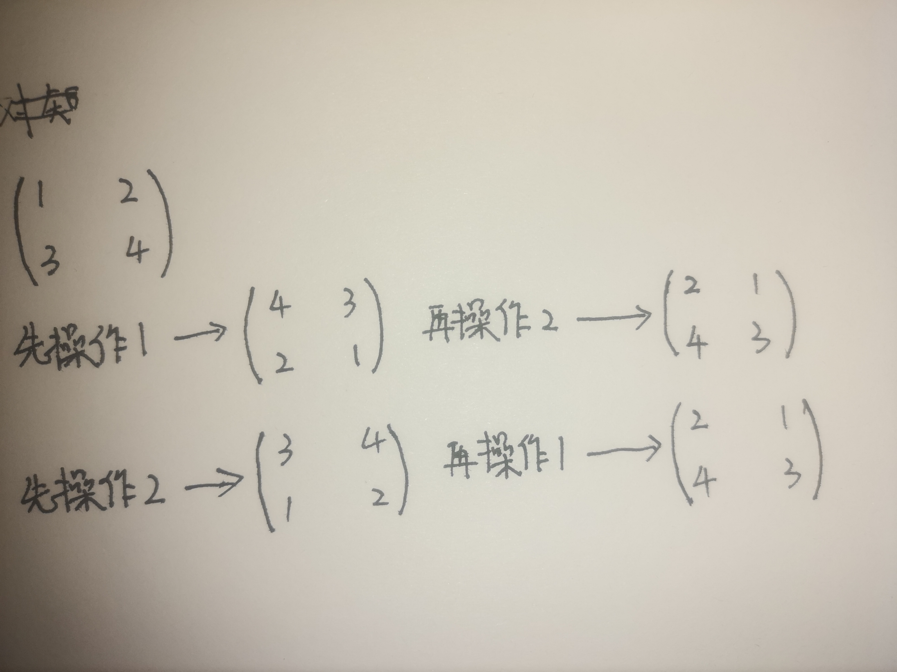

# 2021-7-29比赛报告（牛客小白月赛34）

目录：

- [2021-7-29比赛报告（牛客小白月赛34）](#2021-7-29比赛报告牛客小白月赛34)
  - [A题（dd爱科学1.0）](#a题dd爱科学10)
    - [题目描述](#题目描述)
    - [题目分析](#题目分析)
    - [解题思路](#解题思路)
    - [代码实现](#代码实现)
  - [E题（dd爱旋转）](#e题dd爱旋转)
    - [题目描述](#题目描述-1)
    - [题目分析](#题目分析-1)
    - [解题思路](#解题思路-1)
    - [代码实现](#代码实现-1)
  - [F题（dd爱框框）](#f题dd爱框框)
    - [题目描述](#题目描述-2)
    - [题目分析](#题目分析-2)
    - [解题思路](#解题思路-2)
    - [代码实现](#代码实现-2)
  - [H题（dd爱整齐）](#h题dd爱整齐)
    - [题目描述](#题目描述-3)
    - [题目分析](#题目分析-3)
    - [解题思路](#解题思路-3)
    - [代码实现](#代码实现-3)

## A题（dd爱科学1.0）

[题目链接](https://ac.nowcoder.com/acm/contest/19043/A)

### 题目描述

大科学家dd最近在研究转基因白菜，白菜的基因序列由一串大写英文字母构成，dd经过严谨的推理证明发现，只有当白菜的基因序列呈按位非递减形式时，这株白菜的高附加值将达到最高，于是优秀的dd开始着手修改白菜的基因序列，dd每次修改基因序列的任意位需要的代价是1，dd想知道，修改白菜的基因序列使其高附加值达到最高，所需要的最小代价的是多少。

### 题目分析

修改最少的字符使得整个字符串成为一个最长的非递减的字符串。

### 解题思路

1.创建两个字符数组（a,b）：a数组存放原字符串，b数组存放更新后的最长非递减字符串。
2.将a数组的第一个字符先赋给b；遍历原数组，如果a数组中元素大于b数组的元素则将a数组的元素赋值给b；否则，在b数组中找出第一个大于a[i]的元素的数组下标m，将a[i]赋值给b[m]。
3.最后用原长度减去b数组中的元素在a中少的元素个数即为答案。<br />

### 代码实现

```cpp {.line-numbers}
#include<bits/stdc++.h>
using namespace std;
char a[1000010],b[1000010];
int n,m,ans=1;
int main(){
    cin>>n>>a;
    b[ans]=a[0];
    for(int i=1;i<n;i++)
        if(b[ans]<=a[i]) b[++ans]=a[i];
        else m=upper_bound(b+1,b+ans+1,a[i])-b,b[m]=a[i];
    cout<<n-ans<<endl;
    return 0;
}
```

## E题（dd爱旋转）

[题目链接](https://ac.nowcoder.com/acm/contest/19043/E)

### 题目描述

读入一个n*n的矩阵，对于一个矩阵有以下两种操作
1:顺时针旋$180°$
2:关于行镜像
如
$\left[ \begin{matrix} 1 & 2 \\ 3 & 4\\ \end{matrix} \right]$变成$\left[ \begin{matrix} 3 & 4 \\ 1 & 2\\ \end{matrix} \right]$
给出q个操作，输出操作完的矩阵

### 题目分析

求n*n的矩阵进行q次的变换操作后的矩阵

### 解题思路

1.矩阵顺时针旋转180°实际上可以拆分为两部：上下翻转和左右翻转。
矩阵的镜像操作实际上就是矩阵的上下翻转。所以先定义两个函数：上下翻转的函数和左右翻转的函数。
2.因为不论是先进行1操作还是c操作得到的矩阵都是相同的；进行偶数次的1操作或进行偶数次的2操作都是和原矩阵相同的。

举例说明：


3.由2的分析，只需对q次操作的不同的矩阵操作进行一一统计后在对2取模：等于1则进行相应操作；等于0则不操作。

### 代码实现

```cpp {.line-numbers}
#include<bits/stdc++.h>
using namespace std;
int a[10010][10010];
int n,m,op,p,q;
void fun1(){
    for(int i=0;i<n;i++)for(int j=0;j<n/2;j++) swap(a[j][i],a[n-j-1][i]);
}
void fun2(){
    for(int i=0;i<n;i++)for(int j=0;j<n/2;j++) swap(a[i][j],a[i][n-j-1]);
}
int main(){
    cin>>n;
    for(int i=0;i<n;i++)for(int j=0;j<n;j++)cin>>a[i][j];
    cin>>m;
    for(int i=0;i<m;i++){
        cin>>op;
        if(op==1)p++;
        else q++;
    }
    if(p%2==1)fun1(),fun2();
    if(q%2==1)fun1();
    for(int i=0;i<n;i++){for(int j=0;j<n;j++){cout<<a[i][j]<<" ";}cout<<endl;}
    return 0;
}
```

## F题（dd爱框框）

[题目链接](https://ac.nowcoder.com/acm/contest/19043/F)

### 题目描述

读入n，x,给出n个数$a[1],a[2],……,a[n]$,求最小的区间$[l,r]$，使$a[l]+a[l+1]+……+a[r]≥x$，若存在相同长度区间，输出l最小的那个

### 题目分析

找所有区间值的加和大于所给长度的最小区间

### 解题思路

如果采用暴力肯定炸掉，所以采用前缀和+二分法进行优化。
1.在主函数中用一个数组存储数组的前缀和。
2.建立一个check函数：实现最小区间的查找。
3.查找规则：遍历前缀和数组，从第i个到n个进行查找，先找到i~n的中间那个值mi，比较i~mi之间的加和大小，如果和比所给的值大，则区间缩小再次查找，更新最小的那个值；如果比所给值小则扩大区间再次查找更新。
注：如果使用cin时需要用```cpp ios::sync_with_stdio(false);cin.tie(0);```对输入进行加速，不然可能会爆掉。

### 代码实现

```cpp {.line-numbers}
#include<bits/stdc++.h>
using namespace std;
const int inf=0x3f3f3f3f;
typedef long long ll;
int n,m,k,l,r,c,r0,l0,mi;
ll sum[10000010];
void check(int a,int b){
    l0=inf,r0=inf+inf;
    for(ll i=1;i<=a;i++){
        l=i,r=a,c=inf;
        while(l<=r){
            mi=(l+r)>>1;
            if(sum[mi]-sum[i-1]>=b)r=mi-1,c=min(c,mi);
            else l=mi+1;
        }
        if(c-i<r0-l0)l0=i,r0=c;
    }
    cout<<l0<<" "<<r0<<endl;
}
int main(){  
    ios::sync_with_stdio(false);
    cin.tie(0);
    cin>>n>>m;
    for(ll i=1;i<=n;i++)cin>>k,sum[i]=sum[i-1]+k;
    check(n,m);
    return 0;
}
```

## H题（dd爱整齐）

[题目链接](https://ac.nowcoder.com/acm/contest/19043/H)

### 题目描述

dd认为一个整齐的kk无限序列应该满足如下条件
如 k=1时  ……abababab……
   k=2时  ……abbabbabbabb……
   k=3时  ……abbbabbbabbbab……
k有限序列为k无限序列的任意连续子序列
以此类推，其中a,ba,b为正整数且a≥ba≥b
如$[2,1,1,1,2]，[6,10,6]$都可以认为是一个合法的k=3的k有限序列
现在给你一个序列$c$，它不一定是一个kk有限序列，所以你可以对序列进行修正
对于每次修正，你可以选择一个位置$i(1≤i≤n)$，把$c[i]$变成$c[i]-1$，问把该序列变成k有限序列所需要的最小修正次数

### 题目分析

将一个数组改成指定格式的数组，所需要修正的次数

### 解题思路

在所求的规则序列中i对k+1取余是，余数的位置是相等的都等于a。a的取值应该是这些位置中值最小的那个数，(因为不能进行加法,只能进行减法)。因为$a≥b$,遍历原数组a，利用前缀和找出最小改变量。

### 代码实现

```cpp {.line-numbers}
/*
  每个数组的储存信息：
  a数组：原数组；b数组：原数组中的最小值
  c数组：原数组每个k位置的和；d数组：原数组中k的位置
*/
#include<bits/stdc++.h>
using namespace std;
typedef long long ll;
ll a[10000010],b[10000010],c[10000010],d[10000010],s,p;
ll ans=1e18+11;
int n,m;
int main(){
    ios::sync_with_stdio(false);
    cin.tie(0);
    cin>>n>>m; m++;
    for(int i=1;i<=n;i++)cin>>a[i];
    for(int i=0;i<m;i++) b[i]=1000000001;
    for(int i=1;i<=n;i++)c[i%m]+=a[i];
    for(int i=1;i<=n;i++)b[i%m]=min(b[i%m],a[i]);
    for(int i=1;i<=n;i++)d[i%m]++; s=a[1];
    for(int i=2;i<=n;i++)s=min(s,a[i]);
    for(int i=1;i<=n;i++)p+=a[i];
    for(int i=0;i<m;i++) ans=min(ans,c[i]-b[i]*d[i]+p-c[i]-(1ll*n-d[i])*s);
    cout<<ans<<endl;
    return 0;
}
```
